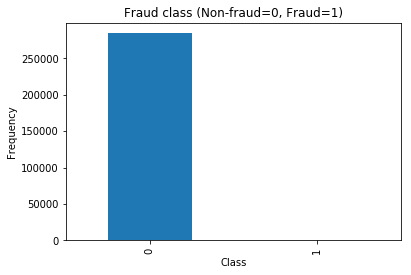
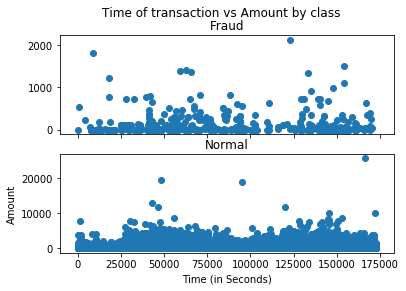
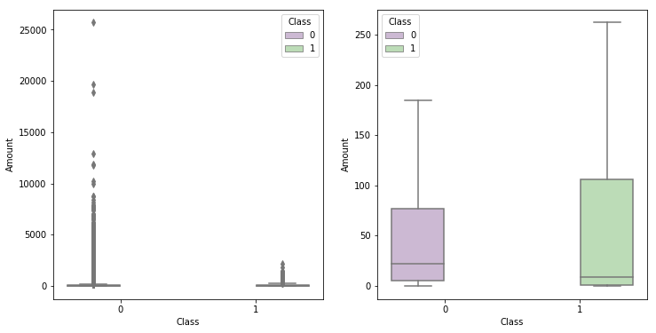
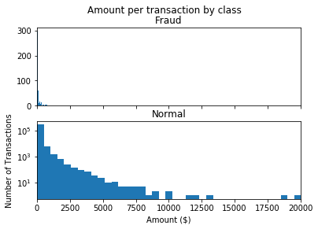
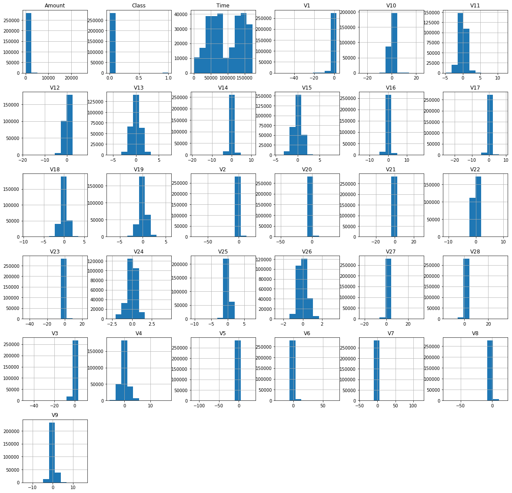
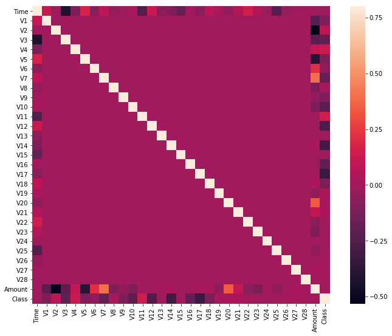
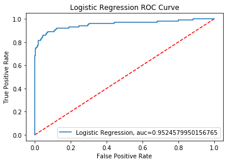

# Credit-Card-Fradulent-Detection
#### Application of Machine Learning Techniques in Credit Card Fraudulent Detection
#### Such as Logistic Regression, Decision Tree (CART), Random Forest, Neural Network and XGBoost.


```python
import pandas as pd
import numpy as np
import matplotlib.pyplot as plt
import seaborn as sns
%matplotlib inline 

# Classifier Libraries
from sklearn.linear_model import LogisticRegression
from sklearn.svm import SVC
from sklearn.neighbors import KNeighborsClassifier
from sklearn.tree import DecisionTreeClassifier
from sklearn.ensemble import RandomForestClassifier
import collections
```


```python
df = pd.read_csv('creditcard.csv')
```


```python
df.head()
```


<table border="1" class="dataframe">
  <thead>
    <tr style="text-align: right;">
      <th></th>
      <th>Time</th>
      <th>V1</th>
      <th>V2</th>
      <th>V3</th>
      <th>V4</th>
      <th>V5</th>
      <th>V6</th>
      <th>V7</th>
      <th>V8</th>
      <th>V9</th>
      <th>...</th>
      <th>V21</th>
      <th>V22</th>
      <th>V23</th>
      <th>V24</th>
      <th>V25</th>
      <th>V26</th>
      <th>V27</th>
      <th>V28</th>
      <th>Amount</th>
      <th>Class</th>
    </tr>
  </thead>
  <tbody>
    <tr>
      <th>0</th>
      <td>0.0</td>
      <td>-1.359807</td>
      <td>-0.072781</td>
      <td>2.536347</td>
      <td>1.378155</td>
      <td>-0.338321</td>
      <td>0.462388</td>
      <td>0.239599</td>
      <td>0.098698</td>
      <td>0.363787</td>
      <td>...</td>
      <td>-0.018307</td>
      <td>0.277838</td>
      <td>-0.110474</td>
      <td>0.066928</td>
      <td>0.128539</td>
      <td>-0.189115</td>
      <td>0.133558</td>
      <td>-0.021053</td>
      <td>149.62</td>
      <td>0</td>
    </tr>
    <tr>
      <th>1</th>
      <td>0.0</td>
      <td>1.191857</td>
      <td>0.266151</td>
      <td>0.166480</td>
      <td>0.448154</td>
      <td>0.060018</td>
      <td>-0.082361</td>
      <td>-0.078803</td>
      <td>0.085102</td>
      <td>-0.255425</td>
      <td>...</td>
      <td>-0.225775</td>
      <td>-0.638672</td>
      <td>0.101288</td>
      <td>-0.339846</td>
      <td>0.167170</td>
      <td>0.125895</td>
      <td>-0.008983</td>
      <td>0.014724</td>
      <td>2.69</td>
      <td>0</td>
    </tr>
    <tr>
      <th>2</th>
      <td>1.0</td>
      <td>-1.358354</td>
      <td>-1.340163</td>
      <td>1.773209</td>
      <td>0.379780</td>
      <td>-0.503198</td>
      <td>1.800499</td>
      <td>0.791461</td>
      <td>0.247676</td>
      <td>-1.514654</td>
      <td>...</td>
      <td>0.247998</td>
      <td>0.771679</td>
      <td>0.909412</td>
      <td>-0.689281</td>
      <td>-0.327642</td>
      <td>-0.139097</td>
      <td>-0.055353</td>
      <td>-0.059752</td>
      <td>378.66</td>
      <td>0</td>
    </tr>
    <tr>
      <th>3</th>
      <td>1.0</td>
      <td>-0.966272</td>
      <td>-0.185226</td>
      <td>1.792993</td>
      <td>-0.863291</td>
      <td>-0.010309</td>
      <td>1.247203</td>
      <td>0.237609</td>
      <td>0.377436</td>
      <td>-1.387024</td>
      <td>...</td>
      <td>-0.108300</td>
      <td>0.005274</td>
      <td>-0.190321</td>
      <td>-1.175575</td>
      <td>0.647376</td>
      <td>-0.221929</td>
      <td>0.062723</td>
      <td>0.061458</td>
      <td>123.50</td>
      <td>0</td>
    </tr>
    <tr>
      <th>4</th>
      <td>2.0</td>
      <td>-1.158233</td>
      <td>0.877737</td>
      <td>1.548718</td>
      <td>0.403034</td>
      <td>-0.407193</td>
      <td>0.095921</td>
      <td>0.592941</td>
      <td>-0.270533</td>
      <td>0.817739</td>
      <td>...</td>
      <td>-0.009431</td>
      <td>0.798278</td>
      <td>-0.137458</td>
      <td>0.141267</td>
      <td>-0.206010</td>
      <td>0.502292</td>
      <td>0.219422</td>
      <td>0.215153</td>
      <td>69.99</td>
      <td>0</td>
    </tr>
  </tbody>
</table>
<p>5 rows × 31 columns</p>
</div>


```python
df.describe()
```


<table border="1" class="dataframe">
  <thead>
    <tr style="text-align: right;">
      <th></th>
      <th>Time</th>
      <th>V1</th>
      <th>V2</th>
      <th>V3</th>
      <th>V4</th>
      <th>V5</th>
      <th>V6</th>
      <th>V7</th>
      <th>V8</th>
      <th>V9</th>
      <th>...</th>
      <th>V21</th>
      <th>V22</th>
      <th>V23</th>
      <th>V24</th>
      <th>V25</th>
      <th>V26</th>
      <th>V27</th>
      <th>V28</th>
      <th>Amount</th>
      <th>Class</th>
    </tr>
  </thead>
  <tbody>
    <tr>
      <th>count</th>
      <td>284807.000000</td>
      <td>2.848070e+05</td>
      <td>2.848070e+05</td>
      <td>2.848070e+05</td>
      <td>2.848070e+05</td>
      <td>2.848070e+05</td>
      <td>2.848070e+05</td>
      <td>2.848070e+05</td>
      <td>2.848070e+05</td>
      <td>2.848070e+05</td>
      <td>...</td>
      <td>2.848070e+05</td>
      <td>2.848070e+05</td>
      <td>2.848070e+05</td>
      <td>2.848070e+05</td>
      <td>2.848070e+05</td>
      <td>2.848070e+05</td>
      <td>2.848070e+05</td>
      <td>2.848070e+05</td>
      <td>284807.000000</td>
      <td>284807.000000</td>
    </tr>
    <tr>
      <th>mean</th>
      <td>94813.859575</td>
      <td>3.919560e-15</td>
      <td>5.688174e-16</td>
      <td>-8.769071e-15</td>
      <td>2.782312e-15</td>
      <td>-1.552563e-15</td>
      <td>2.010663e-15</td>
      <td>-1.694249e-15</td>
      <td>-1.927028e-16</td>
      <td>-3.137024e-15</td>
      <td>...</td>
      <td>1.537294e-16</td>
      <td>7.959909e-16</td>
      <td>5.367590e-16</td>
      <td>4.458112e-15</td>
      <td>1.453003e-15</td>
      <td>1.699104e-15</td>
      <td>-3.660161e-16</td>
      <td>-1.206049e-16</td>
      <td>88.349619</td>
      <td>0.001727</td>
    </tr>
    <tr>
      <th>std</th>
      <td>47488.145955</td>
      <td>1.958696e+00</td>
      <td>1.651309e+00</td>
      <td>1.516255e+00</td>
      <td>1.415869e+00</td>
      <td>1.380247e+00</td>
      <td>1.332271e+00</td>
      <td>1.237094e+00</td>
      <td>1.194353e+00</td>
      <td>1.098632e+00</td>
      <td>...</td>
      <td>7.345240e-01</td>
      <td>7.257016e-01</td>
      <td>6.244603e-01</td>
      <td>6.056471e-01</td>
      <td>5.212781e-01</td>
      <td>4.822270e-01</td>
      <td>4.036325e-01</td>
      <td>3.300833e-01</td>
      <td>250.120109</td>
      <td>0.041527</td>
    </tr>
    <tr>
      <th>min</th>
      <td>0.000000</td>
      <td>-5.640751e+01</td>
      <td>-7.271573e+01</td>
      <td>-4.832559e+01</td>
      <td>-5.683171e+00</td>
      <td>-1.137433e+02</td>
      <td>-2.616051e+01</td>
      <td>-4.355724e+01</td>
      <td>-7.321672e+01</td>
      <td>-1.343407e+01</td>
      <td>...</td>
      <td>-3.483038e+01</td>
      <td>-1.093314e+01</td>
      <td>-4.480774e+01</td>
      <td>-2.836627e+00</td>
      <td>-1.029540e+01</td>
      <td>-2.604551e+00</td>
      <td>-2.256568e+01</td>
      <td>-1.543008e+01</td>
      <td>0.000000</td>
      <td>0.000000</td>
    </tr>
    <tr>
      <th>25%</th>
      <td>54201.500000</td>
      <td>-9.203734e-01</td>
      <td>-5.985499e-01</td>
      <td>-8.903648e-01</td>
      <td>-8.486401e-01</td>
      <td>-6.915971e-01</td>
      <td>-7.682956e-01</td>
      <td>-5.540759e-01</td>
      <td>-2.086297e-01</td>
      <td>-6.430976e-01</td>
      <td>...</td>
      <td>-2.283949e-01</td>
      <td>-5.423504e-01</td>
      <td>-1.618463e-01</td>
      <td>-3.545861e-01</td>
      <td>-3.171451e-01</td>
      <td>-3.269839e-01</td>
      <td>-7.083953e-02</td>
      <td>-5.295979e-02</td>
      <td>5.600000</td>
      <td>0.000000</td>
    </tr>
    <tr>
      <th>50%</th>
      <td>84692.000000</td>
      <td>1.810880e-02</td>
      <td>6.548556e-02</td>
      <td>1.798463e-01</td>
      <td>-1.984653e-02</td>
      <td>-5.433583e-02</td>
      <td>-2.741871e-01</td>
      <td>4.010308e-02</td>
      <td>2.235804e-02</td>
      <td>-5.142873e-02</td>
      <td>...</td>
      <td>-2.945017e-02</td>
      <td>6.781943e-03</td>
      <td>-1.119293e-02</td>
      <td>4.097606e-02</td>
      <td>1.659350e-02</td>
      <td>-5.213911e-02</td>
      <td>1.342146e-03</td>
      <td>1.124383e-02</td>
      <td>22.000000</td>
      <td>0.000000</td>
    </tr>
    <tr>
      <th>75%</th>
      <td>139320.500000</td>
      <td>1.315642e+00</td>
      <td>8.037239e-01</td>
      <td>1.027196e+00</td>
      <td>7.433413e-01</td>
      <td>6.119264e-01</td>
      <td>3.985649e-01</td>
      <td>5.704361e-01</td>
      <td>3.273459e-01</td>
      <td>5.971390e-01</td>
      <td>...</td>
      <td>1.863772e-01</td>
      <td>5.285536e-01</td>
      <td>1.476421e-01</td>
      <td>4.395266e-01</td>
      <td>3.507156e-01</td>
      <td>2.409522e-01</td>
      <td>9.104512e-02</td>
      <td>7.827995e-02</td>
      <td>77.165000</td>
      <td>0.000000</td>
    </tr>
    <tr>
      <th>max</th>
      <td>172792.000000</td>
      <td>2.454930e+00</td>
      <td>2.205773e+01</td>
      <td>9.382558e+00</td>
      <td>1.687534e+01</td>
      <td>3.480167e+01</td>
      <td>7.330163e+01</td>
      <td>1.205895e+02</td>
      <td>2.000721e+01</td>
      <td>1.559499e+01</td>
      <td>...</td>
      <td>2.720284e+01</td>
      <td>1.050309e+01</td>
      <td>2.252841e+01</td>
      <td>4.584549e+00</td>
      <td>7.519589e+00</td>
      <td>3.517346e+00</td>
      <td>3.161220e+01</td>
      <td>3.384781e+01</td>
      <td>25691.160000</td>
      <td>1.000000</td>
    </tr>
  </tbody>
</table>
<p>8 rows × 31 columns</p>
</div>


```python
#No null values
df.isnull().sum()
```


    Time      0
    V1        0
    V2        0
    V3        0
    V4        0
    V5        0
    V6        0
    V7        0
    V8        0
    V9        0
    V10       0
    V11       0
    V12       0
    V13       0
    V14       0
    V15       0
    V16       0
    V17       0
    V18       0
    V19       0
    V20       0
    V21       0
    V22       0
    V23       0
    V24       0
    V25       0
    V26       0
    V27       0
    V28       0
    Amount    0
    Class     0
    dtype: int64


# Checking the target classes


```python
count_classes = pd.value_counts(df['Class'], sort = True).sort_index()
count_classes.plot(kind = 'bar')
plt.title("Fraud class (Non-fraud=0, Fraud=1)")
plt.xlabel("Class")
plt.ylabel("Frequency")
```


    Text(0, 0.5, 'Frequency')





```python
Fraud=df[df['Class']==1]
Normal=df[df['Class']==0]
```


```python
Fraud.shape
```


    (492, 31)


```python
Normal.shape
```


    (284315, 31)


How different are the amount of money used in differernt transaction classes?


```python
Normal.Amount.describe()
```


    count    284315.000000
    mean         88.291022
    std         250.105092
    min           0.000000
    25%           5.650000
    50%          22.000000
    75%          77.050000
    max       25691.160000
    Name: Amount, dtype: float64


```python
# 0 = no fraud; 1 = fraud
print('No Frauds', round(df['Class'].value_counts()[0]/len(df)*100,3), '% of the dataset')
print('Frauds', round(df['Class'].value_counts()[1]/len(df)*100,3), '% of the dataset')
       
```

    No Frauds 99.827 % of the dataset
    Frauds 0.173 % of the dataset
    

#### Most of the transactions in the dataset are non-fraud. The data is totally unbalanced!
There are several ways to approach this problem taking into consideration of this unbalance.
#### Changing the performance metric: use confusion matrix to calculate precision, recall, F1 score, ROC curves

## Transactions in time
#### Do fraud transactions occur more often during certain time frame?


```python
f, (ax1, ax2) = plt.subplots(2, 1, sharex=True)
f.suptitle('Time of transaction vs Amount by class')
ax1.scatter(Fraud.Time, Fraud.Amount)
ax1.set_title('Fraud')
ax2.scatter(Normal.Time, Normal.Amount)
ax2.set_title('Normal')
plt.xlabel('Time (in Seconds)')
plt.ylabel('Amount')
plt.show()
```





#### Doesn't seem like the time of transaction really matters. No trend on the scatter plots.

## Transactions Amount 


```python
fig, (ax1, ax2) = plt.subplots(ncols=2, figsize=(12,6))
s = sns.boxplot(ax = ax1, x="Class", y="Amount", hue="Class",data=df, palette="PRGn",showfliers=True)
s = sns.boxplot(ax = ax2, x="Class", y="Amount", hue="Class",data=df, palette="PRGn",showfliers=False)
plt.show();
```





```python
f, (ax1, ax2) = plt.subplots(2, 1, sharex=True)
f.suptitle('Amount per transaction by class')
bins = 50
ax1.hist(Fraud.Amount, bins = bins)
ax1.set_title('Fraud')
ax2.hist(Normal.Amount, bins = bins)
ax2.set_title('Normal')
plt.xlabel('Amount ($)')
plt.ylabel('Number of Transactions')
plt.xlim((0, 20000))
plt.yscale('log')
plt.show();
```





#### Plot histogram of each parameter 


```python
df.hist(figsize=(20,20))
plt.show()
```





## Correlation Matrix 


```python
correlation_matrix = df.corr()
fig = plt.figure(figsize=(12,9))
sns.heatmap(correlation_matrix,vmax=0.8,square = True)
plt.show()
```





The above correlation matrix shows that none of the V1 to V28 PCA components have any correlation to each other however if we observe Class has some forms of positive and negative correlations with the V components but has no correlation with Time and Amount.

## Get all the columns from the dataframe


```python
columns = df.columns.tolist()
# Filter the columns to remove data we do not want 
columns = [c for c in columns if c not in ["Class"]]
# Store the variable we are predicting 
target = "Class"
# Define a random state 
state = np.random.RandomState(42)
X = df[columns]
Y = df[target]
X_outliers = state.uniform(low=0, high=1, size=(X.shape[0], X.shape[1]))
# Print the shapes of X & Y
print(X.shape)
print(Y.shape)
```

    (284807, 30)
    (284807,)
    


```python
# Our data is already scaled we should split our training and test sets
from sklearn.model_selection import train_test_split

# This is explicitly used for undersampling.
X_train, X_test, y_train, y_test = train_test_split(X, Y, test_size=0.2, random_state=42)
```


```python
X_train = X_train.values
X_test = X_test.values
y_train = y_train.values
y_test = y_test.values
```


```python
print("Length of X_train is: {X_train}".format(X_train = len(X_train)))
print("Length of X_test is: {X_test}".format(X_test = len(X_test)))
print("Length of y_train is: {y_train}".format(y_train = len(y_train)))
print("Length of y_test is: {y_test}".format(y_test = len(y_test)))
```

    Length of X_train is: 227845
    Length of X_test is: 56962
    Length of y_train is: 227845
    Length of y_test is: 56962
    


```python
from sklearn.linear_model import LogisticRegression
from sklearn.metrics import confusion_matrix
```


```python
model = LogisticRegression()
model.fit(X_train, y_train)
```

    C:\Users\meeyoonchoo\Anaconda3\lib\site-packages\sklearn\linear_model\logistic.py:432: FutureWarning: Default solver will be changed to 'lbfgs' in 0.22. Specify a solver to silence this warning.
      FutureWarning)
    


    LogisticRegression(C=1.0, class_weight=None, dual=False, fit_intercept=True,
                       intercept_scaling=1, l1_ratio=None, max_iter=100,
                       multi_class='warn', n_jobs=None, penalty='l2',
                       random_state=None, solver='warn', tol=0.0001, verbose=0,
                       warm_start=False)


```python
y_pred = model.predict(X_test)
```


```python
from sklearn.metrics import classification_report, confusion_matrix, accuracy_score
print(confusion_matrix(y_test,y_pred))
print(classification_report(y_test, y_pred))
print(accuracy_score(y_test,y_pred))
```

    [[56853    11]
     [   46    52]]
                  precision    recall  f1-score   support
    
               0       1.00      1.00      1.00     56864
               1       0.83      0.53      0.65        98
    
        accuracy                           1.00     56962
       macro avg       0.91      0.77      0.82     56962
    weighted avg       1.00      1.00      1.00     56962
    
    0.9989993328885924
    


```python
from sklearn import metrics
y_pred_proba = model.predict_proba(X_test)[::,1]
fpr, tpr, _ = metrics.roc_curve(y_test,  y_pred_proba)
auc = metrics.roc_auc_score(y_test, y_pred_proba)
plt.plot([0, 1], [0, 1],'r--')
plt.xlabel('False Positive Rate')
plt.ylabel('True Positive Rate')
plt.title('Logistic Regression ROC Curve')
plt.plot(fpr,tpr,label="Logistic Regression, auc="+str(auc))
plt.legend(loc="lower right")
plt.show()
```





#### Decision Tree


```python
from sklearn.model_selection import train_test_split

X_train, X_test, y_train, y_test = train_test_split(X, Y, test_size=0.2, random_state=0)
```


```python
from sklearn.tree import DecisionTreeClassifier

# Make a decision tree and train
tree = DecisionTreeClassifier(max_depth=2)
tree.fit(X_train, y_train)

```


    DecisionTreeClassifier(class_weight=None, criterion='gini', max_depth=2,
                           max_features=None, max_leaf_nodes=None,
                           min_impurity_decrease=0.0, min_impurity_split=None,
                           min_samples_leaf=1, min_samples_split=2,
                           min_weight_fraction_leaf=0.0, presort=False,
                           random_state=None, splitter='best')


```python
y_pred = tree.predict(X_test)
```


```python
print(confusion_matrix(y_test,y_pred))
print(classification_report(y_test, y_pred))
print(accuracy_score(y_test,y_pred))
```

    [[56844    17]
     [   26    75]]
                  precision    recall  f1-score   support
    
               0       1.00      1.00      1.00     56861
               1       0.82      0.74      0.78       101
    
        accuracy                           1.00     56962
       macro avg       0.91      0.87      0.89     56962
    weighted avg       1.00      1.00      1.00     56962
    
    0.9992451107756047
    

#### Random Forest 


```python
from sklearn.ensemble import RandomForestClassifier

# Create the model with 100 trees
RF_model = RandomForestClassifier(n_estimators=100, 
                               bootstrap = True,
                               max_features = 'sqrt')
# Fit on training data
RF_model.fit(X_train, y_train)
```


    RandomForestClassifier(bootstrap=True, class_weight=None, criterion='gini',
                           max_depth=None, max_features='sqrt', max_leaf_nodes=None,
                           min_impurity_decrease=0.0, min_impurity_split=None,
                           min_samples_leaf=1, min_samples_split=2,
                           min_weight_fraction_leaf=0.0, n_estimators=100,
                           n_jobs=None, oob_score=False, random_state=None,
                           verbose=0, warm_start=False)


```python
# Actual class predictions
rf_pred = RF_model.predict(X_test)
```


```python
print(confusion_matrix(y_test,rf_pred))
print(classification_report(y_test, rf_pred))
print(accuracy_score(y_test,rf_pred))
```

    [[56855     6]
     [   21    80]]
                  precision    recall  f1-score   support
    
               0       1.00      1.00      1.00     56861
               1       0.93      0.79      0.86       101
    
        accuracy                           1.00     56962
       macro avg       0.96      0.90      0.93     56962
    weighted avg       1.00      1.00      1.00     56962
    
    0.9995259997893332
    

#### Neural Network


```python
from sklearn.neural_network import MLPClassifier

```


```python
# Create the model with 3 layers with 100 neurons
mlp_model = MLPClassifier(hidden_layer_sizes=(100,100,100))
# Fit on training data
mlp_model.fit(X_train, y_train)
```


    MLPClassifier(activation='relu', alpha=0.0001, batch_size='auto', beta_1=0.9,
                  beta_2=0.999, early_stopping=False, epsilon=1e-08,
                  hidden_layer_sizes=(100, 100, 100), learning_rate='constant',
                  learning_rate_init=0.001, max_iter=200, momentum=0.9,
                  n_iter_no_change=10, nesterovs_momentum=True, power_t=0.5,
                  random_state=None, shuffle=True, solver='adam', tol=0.0001,
                  validation_fraction=0.1, verbose=False, warm_start=False)


```python
# Actual class predictions
mlp_pred = mlp_model.predict(X_test)
```


```python
print(confusion_matrix(y_test, mlp_pred))
print(classification_report(y_test, mlp_pred))
print(accuracy_score(y_test, mlp_pred))
```

    [[56861     0]
     [  101     0]]
                  precision    recall  f1-score   support
    
               0       1.00      1.00      1.00     56861
               1       0.00      0.00      0.00       101
    
        accuracy                           1.00     56962
       macro avg       0.50      0.50      0.50     56962
    weighted avg       1.00      1.00      1.00     56962
    
    0.9982268881008391
    

    C:\Users\meeyoonchoo\Anaconda3\lib\site-packages\sklearn\metrics\classification.py:1437: UndefinedMetricWarning: Precision and F-score are ill-defined and being set to 0.0 in labels with no predicted samples.
      'precision', 'predicted', average, warn_for)
    C:\Users\meeyoonchoo\Anaconda3\lib\site-packages\sklearn\metrics\classification.py:1437: UndefinedMetricWarning: Precision and F-score are ill-defined and being set to 0.0 in labels with no predicted samples.
      'precision', 'predicted', average, warn_for)
    C:\Users\meeyoonchoo\Anaconda3\lib\site-packages\sklearn\metrics\classification.py:1437: UndefinedMetricWarning: Precision and F-score are ill-defined and being set to 0.0 in labels with no predicted samples.
      'precision', 'predicted', average, warn_for)
    

#### XGBoost Classifier 


```python
pip install xgboost
```

    Requirement already satisfied: xgboost in c:\users\meeyoonchoo\anaconda3\lib\site-packages (0.90)
    Requirement already satisfied: numpy in c:\users\meeyoonchoo\anaconda3\lib\site-packages (from xgboost) (1.16.2)
    Requirement already satisfied: scipy in c:\users\meeyoonchoo\anaconda3\lib\site-packages (from xgboost) (1.2.1)
    Note: you may need to restart the kernel to use updated packages.
    


```python
import xgboost as xgb
```


```python
from xgboost import XGBClassifier

# Create the model 
xgb_model = XGBClassifier()
# Fit on training data
xgb_model.fit(X_train, y_train)
```


    XGBClassifier(base_score=0.5, booster='gbtree', colsample_bylevel=1,
                  colsample_bynode=1, colsample_bytree=1, gamma=0,
                  learning_rate=0.1, max_delta_step=0, max_depth=3,
                  min_child_weight=1, missing=None, n_estimators=100, n_jobs=1,
                  nthread=None, objective='binary:logistic', random_state=0,
                  reg_alpha=0, reg_lambda=1, scale_pos_weight=1, seed=None,
                  silent=None, subsample=1, verbosity=1)


```python
# Actual class predictions
xgb_pred = xgb_model.predict(X_test)
```


```python
print(confusion_matrix(y_test,xgb_pred))
print(classification_report(y_test, xgb_pred))
print(accuracy_score(y_test,xgb_pred))
```

    [[56851    10]
     [   21    80]]
                  precision    recall  f1-score   support
    
               0       1.00      1.00      1.00     56861
               1       0.89      0.79      0.84       101
    
        accuracy                           1.00     56962
       macro avg       0.94      0.90      0.92     56962
    weighted avg       1.00      1.00      1.00     56962
    
    0.9994557775359011
    


```python
xgb_prob = xgb_model.predict_proba(X_test)
xgb_prob = [x[1] for x in xgb_prob]

threshold = 0.2

xgb_pred = [x > threshold for x in xgb_prob]

```


```python
print(confusion_matrix(y_test,xgb_pred))
print(classification_report(y_test, xgb_pred))
print(accuracy_score(y_test,xgb_pred))
```

    [[56844    17]
     [   16    85]]
                  precision    recall  f1-score   support
    
               0       1.00      1.00      1.00     56861
               1       0.83      0.84      0.84       101
    
        accuracy                           1.00     56962
       macro avg       0.92      0.92      0.92     56962
    weighted avg       1.00      1.00      1.00     56962
    
    0.999420666409185
    

With threshold = 0.2, it yield same result for F1 score.


```python

```
